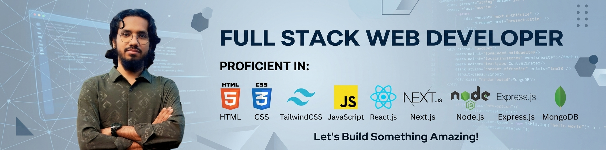

<!-- Banner -->

  

<h1 align="center">👋 Hi, I'm <strong>AKM Zakaria</strong></h1>

---

## 🧑‍💻 About Me
Full-stack web developer skilled in React, Node.js, Express.js, and MongoDB.  
Currently learning Next.js to build fast, scalable, and modern full-stack applications.

---

## 🚀 Technologies & Tools

   &nbsp;
   &nbsp;
   &nbsp;
   &nbsp;
   &nbsp;
  

   &nbsp;
   &nbsp;
  

---

## 🌐 Connect With Me

